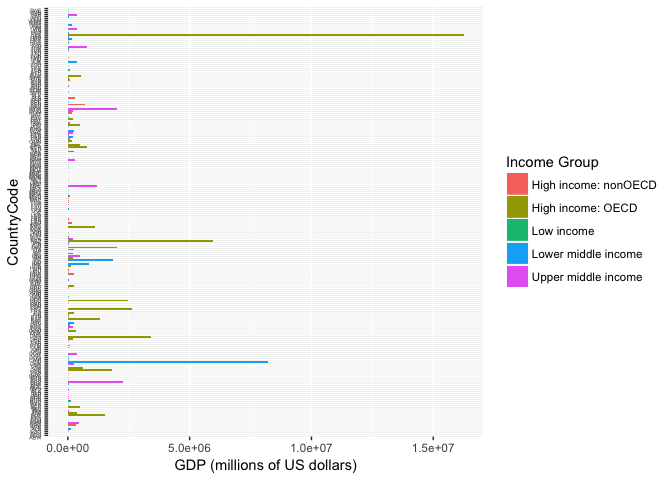
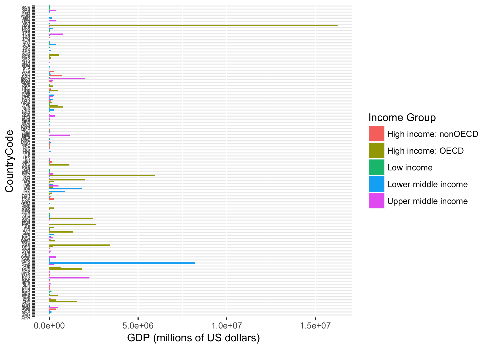
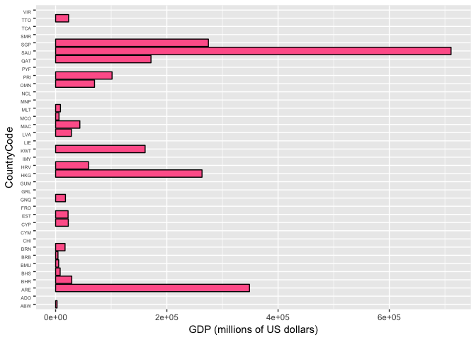
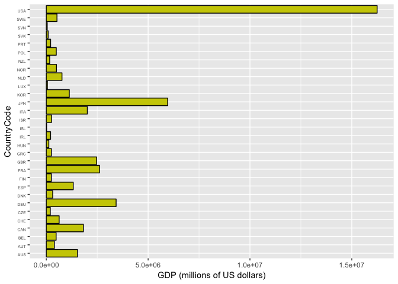
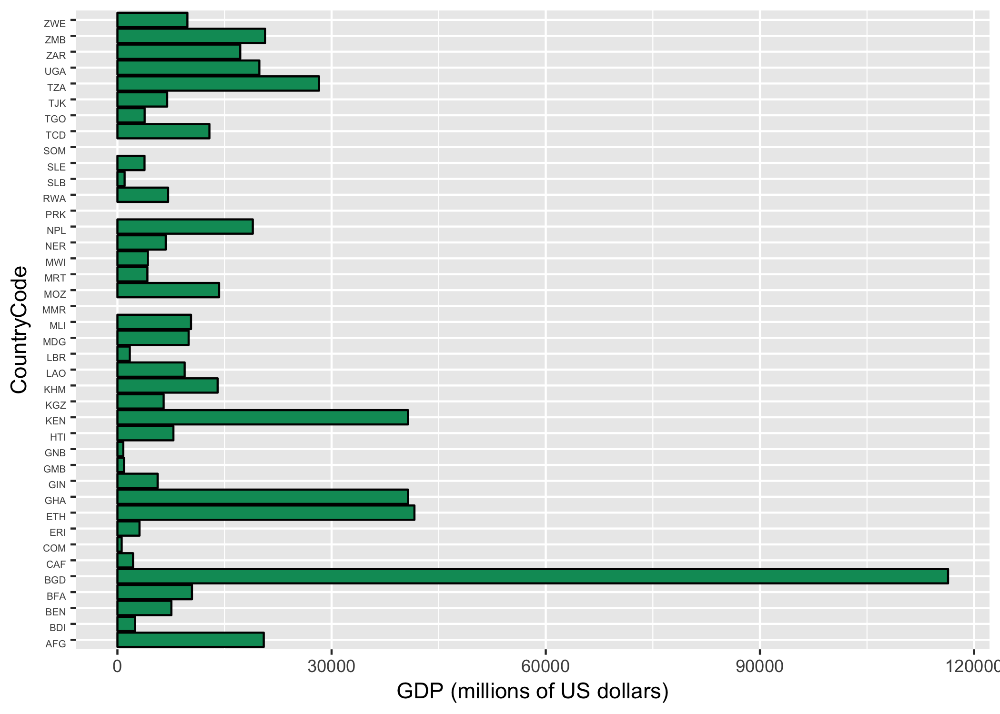
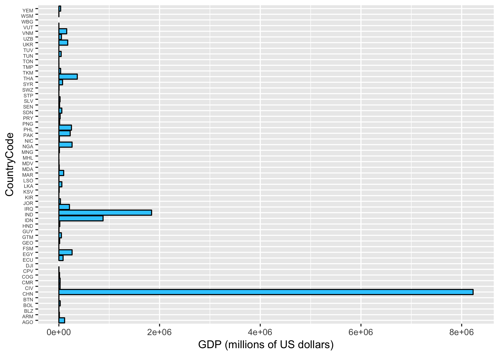
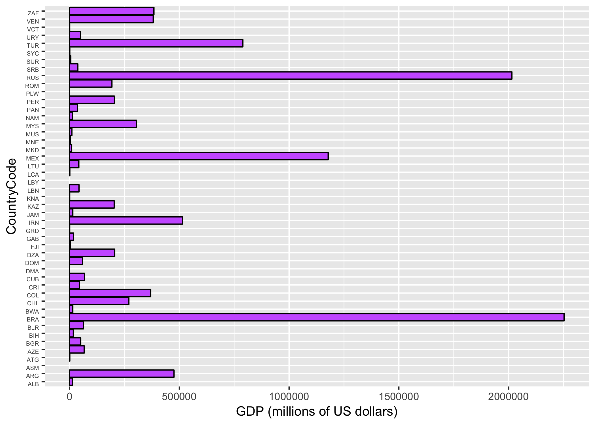

R Markdown
----------

The code for downloading, tyding and merging data in a R Markdown file.
The files are included in a makefile format

    #downloading
    source("Download.R")

    #Cleaning
    source("Cleaning.R")

    ## 'data.frame':    215 obs. of  5 variables:
    ##  $ V1: chr  "USA" "CHN" "JPN" "DEU" ...
    ##  $ V2: int  1 2 3 4 5 6 7 8 9 10 ...
    ##  $ V4: chr  "United States" "China" "Japan" "Germany" ...
    ##  $ V5: chr  " 16,244,600 " " 8,227,103 " " 5,959,718 " " 3,428,131 " ...
    ##  $ V6: chr  "" "" "" "" ...
    ## 'data.frame':    214 obs. of  5 variables:
    ##  $ CountryCode                 : chr  "USA" "CHN" "JPN" "DEU" ...
    ##  $ Rank                        : int  1 2 3 4 5 6 7 8 9 10 ...
    ##  $ Economy                     : chr  "United States" "China" "Japan" "Germany" ...
    ##  $ GDP (millions of US dollars): chr  " 16,244,600 " " 8,227,103 " " 5,959,718 " " 3,428,131 " ...
    ##  $ Note                        : chr  "" "" "" "" ...

    ## Warning: NAs introduced by coercion

    #merging the data into a Data fram object testMerge
    source ("Merging.R")

    match<-testMerge[which(!is.na(testMerge$`CountryCode`)),1]

The answers to the questions of interest are:

1.  The number of countries that match are: 210

<!-- -->

    ## 2 - Sort Ascending GDP DATA

    testMerge <- testMerge[order(testMerge$`GDP (millions of US dollars)`, decreasing = FALSE),]

1.  The 13th country with the GDP (ascended order) is: St. Kitts and
    Nevis

<!-- -->

    #Retreiving the data for the income group: High income: OECD
    tHiOE<-subset(x=testMerge,`Income Group`=='High income: OECD')
    HiInOecd <- mean(tHiOE$`Rank`,na.rm=TRUE)

1.  The average GDP rankings for the "High Income OECD is: 32.9666667

<!-- -->

    #Retreiving the data for the income group: High income: nonOECD
    tHiNOE<-subset(x=testMerge,`Income Group`=='High income: nonOECD')
    HiInNOecd <- mean(tHiNOE$`Rank`,na.rm=TRUE)
    HiInNOecd

    ## [1] 91.91304

The average GDP rankings for the "High Income nonOECD" is: 91.9130435

    #Number of missing values for High income: nonOECD
    CountMissing_HiNOE<-length(which(is.na(tHiNOE$`Rank`)))
    CountMissing_HiNOE

    ## [1] 14

The number of missing rankings for the group "High Income nonOECD" is:
14

1.  Plot the GDP for all the countries.

<!-- -->

    ##Plot the GDP for all of the countries, color plot by Income Group
    library(ggplot2)
    ggplot(testMerge, aes(x=`CountryCode`, y=`GDP (millions of US dollars)`, fill=`Income Group`)) +
      geom_bar(stat='identity') +
      coord_flip() +
      theme(axis.text.y = element_text(vjust = 1, size = 4))

    ## Warning: Removed 21 rows containing missing values (position_stack).

    #Saving the plot in png format to be displayed in Github
    ggsave("all.png")

    ## Saving 7 x 5 in image

    ## Warning: Removed 21 rows containing missing values (position_stack).

    #We create different dataframe for each income group

    HighIncomeNonOECD <- testMerge[which(testMerge$`Income Group` == 'High income: nonOECD'),]
    HighIncomeOECD <- testMerge[which(testMerge$`Income Group` == 'High income: OECD'),]
    LowIncome <- testMerge[which(testMerge$`Income Group` == 'Low income'),]
    LowerMiddleIncome <- testMerge[which(testMerge$`Income Group` == 'Lower middle income'),]
    UpperMiddleIncome <- testMerge[which(testMerge$`Income Group` == 'Upper middle income'),]

4.1) Plot the GDP for countries with HighIncomeNonOECD

    ggplot(HighIncomeNonOECD, aes(x=`CountryCode`, y=`GDP (millions of US dollars)`, fill=`Income Group`)) +
      geom_bar(stat='identity', fill = '#FF6699', color = 'black') +
      coord_flip() +
      theme(axis.text.y = element_text(vjust = 1, size = 5))

    ## Warning: Removed 14 rows containing missing values (position_stack).

    ggsave("HighIncomeNonOECD.png")

    ## Saving 7 x 5 in image

    ## Warning: Removed 14 rows containing missing values (position_stack).

4.2) Plot the GDP for countries with HighIncomeOECD

    ggplot(HighIncomeOECD, aes(x=`CountryCode`, y=`GDP (millions of US dollars)`, fill=`Income Group`)) +
      geom_bar(stat='identity', fill = '#CCCC00', color = 'black') +
      coord_flip() +
      theme(axis.text.y = element_text(vjust = 1, size = 5))

    ggsave("HighIncomeOECD.png")

    ## Saving 7 x 5 in image

4.3) Plot the GDP for countries with LowIncome

    ggplot(LowIncome, aes(x=`CountryCode`, y=`GDP (millions of US dollars)`, fill=`Income Group`)) +
      geom_bar(stat='identity', fill = '#009966', color = 'black') +
      coord_flip() +
      theme(axis.text.y = element_text(vjust = 1, size = 5))

    ## Warning: Removed 3 rows containing missing values (position_stack).

    ggsave("LowIncome.png")

    ## Saving 7 x 5 in image

    ## Warning: Removed 3 rows containing missing values (position_stack).

4.4) Plot the GDP for countries with LowerMiddleIncome

    ggplot(LowerMiddleIncome, aes(x=`CountryCode`, y=`GDP (millions of US dollars)`, fill=`Income Group`)) +
      geom_bar(stat='identity', fill = '#33CCFF', color = 'black') +
      coord_flip() +
      theme(axis.text.y = element_text(vjust = 1, size = 5))

    ## Warning: Removed 2 rows containing missing values (position_stack).

    ggsave("LowerMiddleIncome.png")

    ## Saving 7 x 5 in image

    ## Warning: Removed 2 rows containing missing values (position_stack).

4.5) Plot the GDP for countries with UpperMiddleIncome

    ggplot(UpperMiddleIncome, aes(x=`CountryCode`, y=`GDP (millions of US dollars)`, fill=`Income Group`)) +
      geom_bar(stat='identity', fill = '#CC66FF', color = 'black') +
      coord_flip() +
      theme(axis.text.y = element_text(vjust = 1, size = 5))

    ## Warning: Removed 2 rows containing missing values (position_stack).

    ggsave("UpperMiddleIncome.png")

    ## Saving 7 x 5 in image

    ## Warning: Removed 2 rows containing missing values (position_stack).

    ##5- cut the gdp ranking into 5 SEPARATE QUANTILE GROUPS
    ## Counting the Missing Values in `Rank`

    #counting the number of missing obervations in Rank
    CountMissing_Rank<-length(which(is.na(testMerge$`Rank`)))
    CountMissing_Rank

    ## [1] 21

    #We get rid of missing values in the ranking Rank: 
    Ranks_GDP<-testMerge[which(!is.na(testMerge$`Rank`)),]

    Ranks_GDP <- within(Ranks_GDP
                       ,quartile <- as.integer(cut(`GDP (millions of US dollars)`, quantile(`GDP (millions of US dollars)`, probs=0:5/5), include.lowest=TRUE)))

    #getting the 38 nations with the highest income
    Ranks_GDP_<-subset(Ranks_GDP[,c("Rank","Economy","GDP (millions of US dollars)","Income Group","quartile")],quartile==5 & `Income Group`=="Lower middle income")

    #number of 38 nations with the highest gdp ranking and have "lower middle income is:"
    num38LowMid<- length(Ranks_GDP_[,1])
    #The 38 nations with the highets gdp and "lower middle income are"
    Ranks_GDP_[order(Ranks_GDP_$`GDP (millions of US dollars)`, decreasing = TRUE),]

    ##     Rank          Economy GDP (millions of US dollars)        Income Group
    ## 37     2            China                      8227103 Lower middle income
    ## 87    10            India                      1841710 Lower middle income
    ## 85    16        Indonesia                       878043 Lower middle income
    ## 184   31         Thailand                       365966 Lower middle income
    ## 56    38 Egypt, Arab Rep.                       262832 Lower middle income
    ##     quartile
    ## 37         5
    ## 87         5
    ## 85         5
    ## 184        5
    ## 56         5

1.  Cutting GDP ranking into 5 separate quantile groups. The number of
    coutries that are: lower middle income but among the highest GDP
    are: 5

Note: There are 21 countries not ranked.
